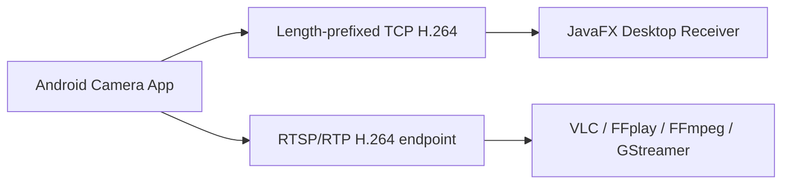
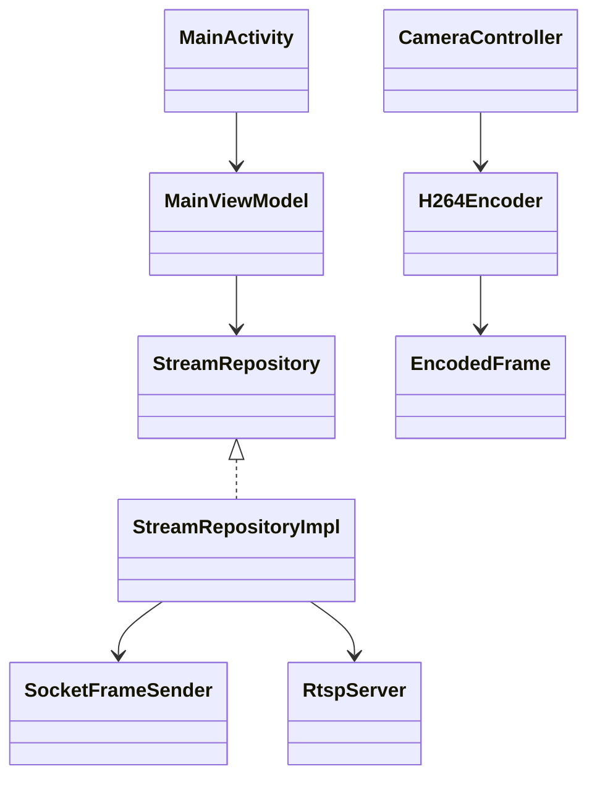
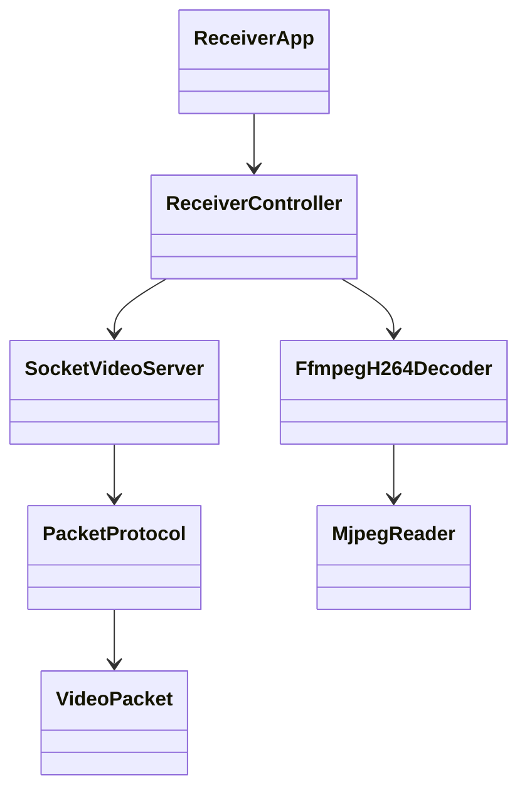
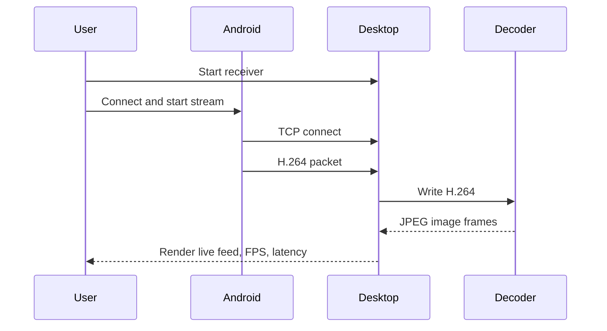
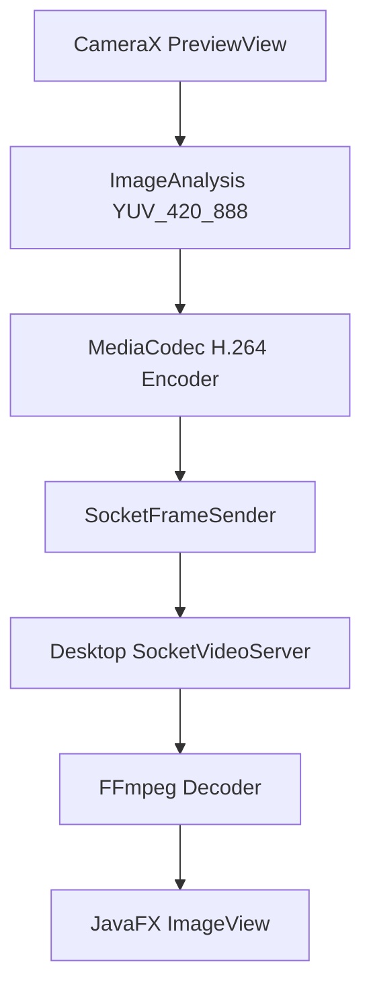
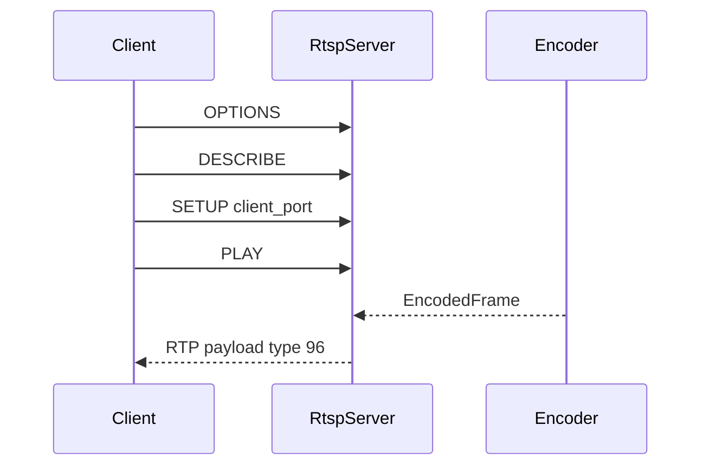

# Architecture

## System Diagram



## Android Class Diagram



## Desktop Class Diagram



## Sequence Diagram



## Streaming Flow



## RTSP Flow



## Network Protocol

```text
int32  magic 0x4C565331
uint8  version 1
uint8  flags bit0=keyframe
int64  timestampUs
int32  payloadLength, max 2 MiB
byte[] H.264 access unit
```

Security controls:

- IP and port validation on Android.
- Max frame size enforcement on both sender and receiver.
- Malformed packets close only the offending socket.
- Sockets and codecs are closed during lifecycle transitions.

